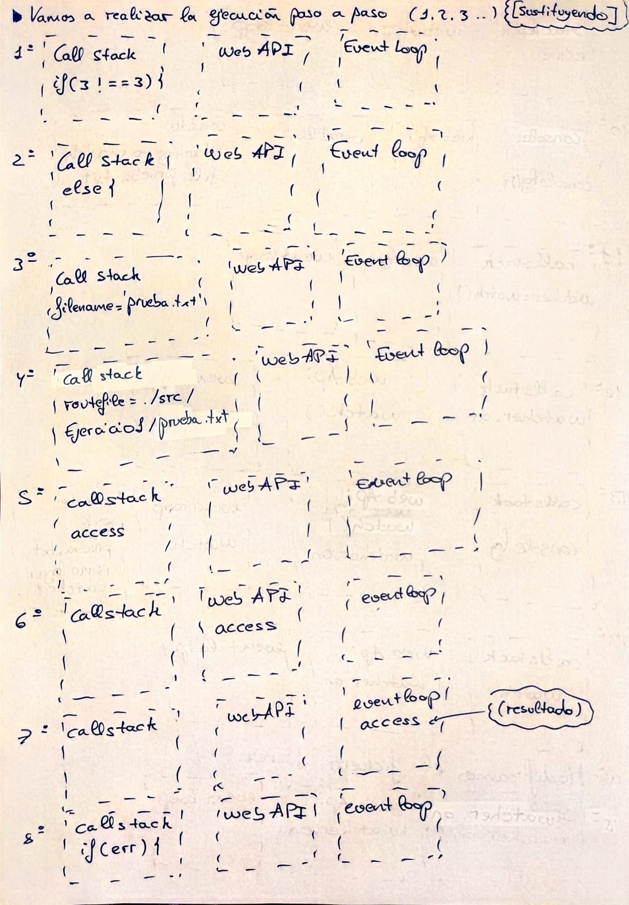
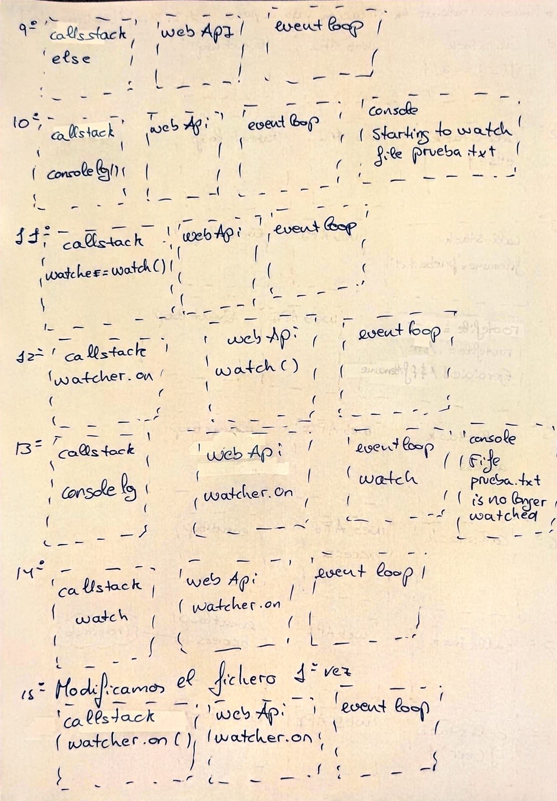
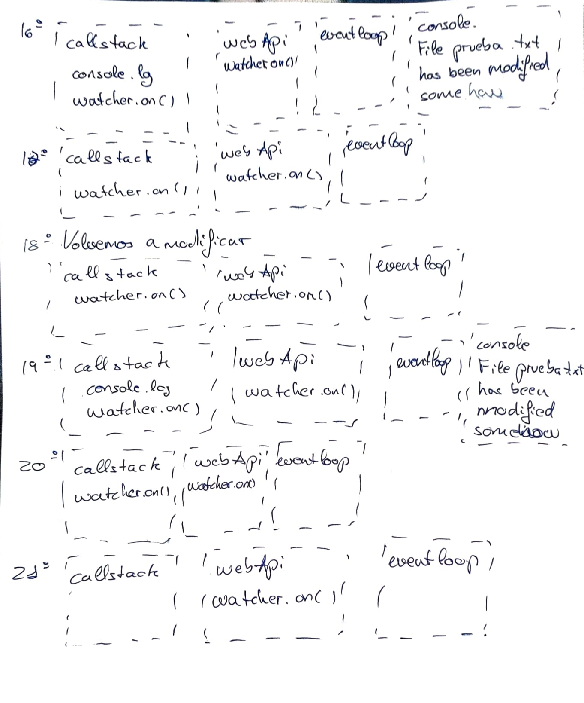

# Práctica 10 - Sistema de ficheros y creación de procesos en Node.js
## Autor: Vlatko Jesús Marchán Sekulic.

---

## Calidad y seguridad del código fuente mediante Sonar Cloud

<p align="center">
    <a href="https://sonarcloud.io/summary/new_code?id=ULL-ESIT-INF-DSI-2122_ull-esit-inf-dsi-21-22-prct10-async-fs-process-alu0101321141.github.io">
        
    </a>
    <a href="https://sonarcloud.io/summary/new_code?id=ULL-ESIT-INF-DSI-2122_ull-esit-inf-dsi-21-22-prct10-async-fs-process-alu0101321141.github.io">
        
    </a>
    <a href="https://coveralls.io/github/ULL-ESIT-INF-DSI-2122/ull-esit-inf-dsi-21-22-prct10-async-fs-process-alu0101321141.github.io?branch=main">
        
    </a>
</p>

---

## Ejercicio 1. 

El programa proporcionado por el profesorado funciona para poner en vigilancia un fichero y en caso de ser modificado se anuncie el mensaje "has been modified somehow.".

Para ello se utilizan las funciones __access__ que prueba si un usuario puede acceder a la ruta/fichero especificado. y con la función __watch__ ponemos en vigilancia el fichero.

* ¿Para qué sirve el objeto constants?

El objeto _constant_ continene las constantes de uso común para las operaciones del sistema de archivos (de acceso a archivos, apetura de archivos, ...).

* __Traza de ejecución__  que sigue nuestro programa:

```typescript
import { access, constants, watch } from 'fs';

if (process.argv.length !== 3) {
  console.log('Please, specify a file');
} else {
  const filename = process.argv[2];
  const routeFile = `./src/Ejercicio1/${filename}`;
  access(routeFile, constants.F_OK, (err) => {
    if (err) {
      console.log(`File ${filename} does not exist`);
    } else {
      console.log(`Starting to watch file ${filename}`);

      const watcher = watch(routeFile);

      watcher.on('change', () => {
        console.log(`File ${filename} has been modified somehow`);
      });

      console.log(`File ${filename} is no longer watched`);
    }
  });
}
```

Ponemos como ejecución _nodejs dis/Ejercicio1/ejercicio1.js prueba.txt_ Por lo que tomamos: 







---

## Ejercicio 2.

En el ejercicio se nos propone crear una expación del comando __grep__ con la salida proporcionada por el comando __cat__.

Para ello se nos piden dos versiones diferenciadas para realizar dicha expansión, por otro lado para obtener los datos pasados al programa utilizamos yargs, en el que se definió el comando y los argumentos _file_ y _word_. En el que el _File_ es el nombre del fichero a comprobar su contenido y el _word_ es la palabra por la que filtrará el comando __grep__

* __Método Pipe de un Stream:__ cabe destacar que cada paso del algoritmo se encuentra comentado para conocer su comportamiento específico. Este método 

```typescript
/**
 * Comando CountWordPipe.
 */
yargs.command({
  command: 'countWordPipe',
  describe: 'Cuenta las veces que se repite una palabra en un fichero (Usando Stream)',
  builder: {
    file: {
      describe: 'Nombre del fichero',
      demandOption: true,
      type: 'string',
    },
    word: {
      describe: 'Palabra a contar',
      demandOption: true,
      type: 'string',
    },
  },
  handler(argv) {
    if (typeof argv.file === 'string' && typeof argv.word === 'string') {
      // Comprobamos el fichero dado se puede leer
      const archiveRoute:string = './src/Ejercicio2/' + argv.file;
      fs.access(`${archiveRoute}`, fs.constants.F_OK, (err) => {
        if (err) {
          console.log(chalk.blackBright.bold.bgRedBright('El fichero no existe.'));
        } else {
          console.log(chalk.blackBright.bold.bgGreenBright('El fichero existe.'));
          // Creamos los procesos Cat y Grep.
          const cat = spawn('cat', [`${archiveRoute}`]);
          const grep = spawn('grep', [`${argv.word}`]);
          let resultComands:string = '';
          // Procedemos a hacer la pipe entre cat y grep
          cat.stdout.pipe(grep.stdin);

          // Comprobamos errores Posibles errores.
          cat.on('error', (err) => {
            console.log(chalk.blackBright.bold.bgRedBright(`Error: ${err}`));
          });
          grep.on('error', (err) => {
            console.log(chalk.blackBright.bold.bgRedBright(`Error: ${err}`));
          });

          // Variable en la que guardaremos el resultado de Grep.
          grep.stdout.on('data', (element) => {
            resultComands += element;
          });

          // Una Vez finalice el proceso de los comandos y tengamos el resultado
          // procedemos a contar las veces que aparece la palabra.
          grep.on('close', () => {
            // Utilizamos una expresión regular para contar las veces que aparece la palabra.
            const Regex = RegExp(`${argv.word}`, 'gm');
            const concurrencias = resultComands.match(Regex);
            let resultado:number = 0;
            if (concurrencias) {
              resultado = concurrencias.length;
            }
            // Imprimimos el resultado.
            if (resultado === 0) {
              console.log(chalk.blackBright.bold.bgRedBright(`La palabra ${argv.word} no aparece en el fichero.`));
            } else {
              console.log(chalk.blackBright.bold.bgGreenBright(`La palabra ${argv.word} aparece ${resultado} veces.`));
            }
          });
        }
      });
    }
  },
});

```

* __Sin Método Pipe de un Stream:__ cabe destacar que al igual que el anterior cada paso del algoritmo se encuentra comentado para conocer su comportamiento específico. Para llevar a cabo esto se necesitó conectar ambos procesos utilizando manejadores. Y pasando la información resultante del comando __cat__ al __grep__ con el uso específio de _grep.stdin.write(element);_ y al finalizar __cat__ terminamos el envío de datos. __grep.stdin.end();__

```typescript
/**
 * Comando CountWordStream.
 */
yargs.command({
  command: 'countNoPipe',
  describe: 'Cuenta las veces que se repite una palabra en un fichero Sin uso de pipe',
  builder: {
    file: {
      describe: 'Nombre del fichero',
      demandOption: true,
      type: 'string',
    },
    word: {
      describe: 'Palabra a contar',
      demandOption: true,
      type: 'string',
    },
  },
  handler(argv) {
    if (typeof argv.file === 'string' && typeof argv.word === 'string') {
      // Comprobamos el fichero dado se puede leer
      const archiveRoute: string = './src/Ejercicio2/' + argv.file;
      fs.access(`${archiveRoute}`, fs.constants.F_OK, (err) => {
        if (err) {
          console.log(chalk.blackBright.bold.bgRedBright('El fichero no existe.'));
        } else {
          console.log(chalk.blackBright.bold.bgGreenBright('El fichero existe.'));
          // Creamos el proceso Grep. y a diferencia del anterior en vez de hacer una pipe
          // con el comando cat le damos la ruta del fichero.
          const cat = spawn('cat', [`${archiveRoute}`]);
          const grep = spawn('grep', [`${argv.word}`]);
          let resultComands: string = '';
          // Procedemos a enviarle la indormación del cat al proceso grep
          cat.stdout.on('data', (element) => {
            grep.stdin.write(element);
          });
          // Comprobamos errores Posibles errores.
          cat.on('error', (err) => {
            console.log(chalk.blackBright.bold.bgRedBright(`Error: ${err}`));
          });
          grep.on('error', (err) => {
            console.log(chalk.blackBright.bold.bgRedBright(`Error: ${err}`));
          });
          // Una vez se termine el proceso cat finalizamos el envio a grep.
          cat.stdout.on('end', () => {
            grep.stdin.end();
          });
          // Guerdamos el resutado del comando grep.
          grep.stdout.on('data', (element) => {
            resultComands += element;
          });
          grep.on('close', () => {
            // Utilizamos una expresión regular para contar las veces que aparece la palabra.
            const Regex = RegExp(`${argv.word}`, 'gm');
            const concurrencias = resultComands.match(Regex);
            let resultado: number = 0;
            if (concurrencias) {
              resultado = concurrencias.length;
            }
            // Imprimimos el resultado.
            if (resultado === 0) {
              console.log(chalk.blackBright.bold.bgRedBright(`La palabra ${argv.word} no aparece en el fichero.`));
            } else {
              console.log(chalk.blackBright.bold.bgGreenBright(`La palabra ${argv.word} aparece ${resultado} veces.`));
            }
          });
        }
      });
    }
  },
});
```

---

## Ejercicio 3.

Para el desarrolllo del ejercicio 3 se nos plantea crear una clase __watcher__ para vigilar los cambios que se producen en cada momento en un directorio mientras que el usuario interactua con la aplicación de notas utilizada en la anterior Práctica. (Ya que dicha clase fue explicada en la anterior práctica no se volverá a especificar ya que no ha sufrido ningún cambio de una implementación a otra), de esta manera la clase Watcher consta de:

* __Constructor:__ El constructor pide el path (ruta) del directorio que se desea vigilar y el nombre de usuario que invoca el método.

```typescript
constructor(private path: string, private nameUser: string) {
}
```

* __Método watch__: se encarga de vigilar el directorio, para ello primero comprueba si el fichero existe. En caso de que exista lo ponemos en vigilancia con la función watch, Mediante los eventos de watch __rename__ y __change__ podemos controlar. En el caso de _rename_ si se elimina el fichero o se crea, para distinguir los dos casos ponemos un _fs.access_, en caso de poder acceder es un fichero que se ha creado y en caso contrario que ha sido eliminado. __change__ aparecerá cada ve que se haga una modificación al contenido de un fichero.

```typescript 
watch() {
    // Comprobamos si existe el archivo.
    fs.access(this.path, fs.constants.F_OK, (err) => {
      if (err) {
        console.log(chalk.blackBright.bold.bgRedBright(`La ruta del usuario ${this.nameUser} no existe.`));
      } else {
        console.log(chalk.blackBright.bold.bgGreenBright(`La ruta del usuario ${this.nameUser} existe.`));
        // Creamos el proceso watch
        fs.watch(`${this.path}`, (eventType, filename) => {
          if (eventType == 'rename') {
            // En caso de que se pueda acceder es que se creo. En caso contrario se elimino o
            // se le cambió el nombre.
            fs.access(`${this.path}/${filename}`, fs.constants.F_OK, (err) => {
              if (err) {
                console.log(chalk.blackBright.bold.bgRedBright(`Se ha eliminado ${filename}`));
              } else {
                console.log(chalk.blackBright.bold.bgBlueBright(`Se ha creado ${filename}`));
              }
            });
          } else if (eventType == 'change') {
            console.log(chalk.blackBright.bold.bgWhiteBright(`Se ha modificado ${filename}`));
          }
        });
      }
    });
  }
```

Por otro lado, para que el usuario interactue con la clase se le creó un comando con el uso de _yargs_, 

```typescript 
/**
 * Comando watch
 */
yargs.command({
  command: 'watch',
  describe: 'Vigila la carpeta de un usuario',
  builder: {
    path: {
      describe: 'Ruta de la carpeta a vigilar',
      demandOption: true,
      type: 'string',
    },
    user: {
      describe: 'name User',
      demandOption: true,
      type: 'string',
    },
  },
  handler(argv) {
    if ((typeof argv.path === 'string') && (typeof argv.user === 'string')) {
      const watch = new Watcher(argv.path, argv.user);
      watch.watch();
    }
  },
});
```

* ¿Cómo haría para mostrar, no solo el nombre, sino también el contenido del fichero, en el caso de que haya sido creado o modificado?

unsa solución utilizando funciones de __fs__ podría ser con el nombre que nos indica el método watch con el _filename_ obtener el contenido con el uso del comando _fs.readFile_ 


* ¿Cómo haría para que no solo se observase el directorio de un único usuario sino todos los directorios correspondientes a los diferentes usuarios de la aplicación de notas?

Para que se pudiera observar no solo el directorio sino todos los directorios, tendríamos que llamar la función _watch_ desde el path: __"./AppDataBase"__ y además deberemos poner la opción _{recursive: true}_. (Sin embargo esta opción no es compatible en todas las plataformas tal y como indica la Documentación del método).

---

## Ejercicio 4.

Para el ejercicio 4 se nos pidió la implementación de una __clase wrapper__, para pasarle los datos a los métodos dicha clase se utilizaron comandos creados por _yargs_ (Como todos piden los mismos elementos que los métodos solo especificamos en este documento el primero y el resto son iguales).

```typescript
/**
 * Instancia de la clase Wrapper
 */
const wrapper = new Wrapper();

/**
 * Comando fileordir
 */
yargs.command({
  command: 'fileordir',
  describe: 'Comprueba si una ruta es un directorio o un archivo',
  builder: {
    path: {
      describe: 'Ruta a comprobar',
      demandOption: true,
      type: 'string',
    },
  },
  handler(argv) {
    if ((typeof argv.path === 'string')) {
      wrapper.dirOrFile(argv.path);
    }
  },
});
```
Ahora los médetodos de la __clase wrapper:__

* __constructor:__ su constructor es vacio ya que no requiere del almacenamiento de nigún dato ya que opera directamente con los path pasados a las funciones.


* __dirOrFile:__ Comprueba si la ruta que se le pasa es un directorio o un fichero. Para ello utilizamos la función __lstat__.

```typescript
dirOrFile(path: string) {
    fs.lstat(path, (err, stats) => {
      if (err) {
        console.log(chalk.blackBright.bold.bgRedBright(`La ruta no existe.`));
      } else {
        if (stats.isDirectory()) {
          console.log(chalk.blackBright.bold.bgGreenBright(`La ruta existe y es un directorio.`));
        } else {
          console.log(chalk.blackBright.bold.bgBlueBright(`La ruta existe y es un archivo.`));
        }
      }
    });
  }
```

* __createDir:__ Crea un un directorio en la ruta pasada a la fución, para ello utilizamos la función __mkdir.__

```typescript
  createDir(path: string) {
    fs.mkdir(path, (err) => {
      if (err) {
        console.log(chalk.blackBright.bold.bgRedBright(`Se ha producido un error al crear el directorio:`));
        console.log(chalk.blackBright.bold.bgRedBright(`${err}`));
      } else {
        console.log(chalk.blackBright.bold.bgGreenBright(`El directorio se ha creado correctamente.`));
      }
    });
  }
```

* __listDir:__ dado una ruta lista los ficheros que contiene el directorio.

```typescript
  listDir(path: string) {
    fs.readdir(path, (err, files) => {
      if (err) {
        console.log(chalk.blackBright.bold.bgRedBright(`Se ha producido un error al listar los ficheros:`));
        console.log(chalk.blackBright.bold.bgRedBright(`${err}`));
      } else {
        console.log(chalk.blackBright.bold.bgGreenBright(`Listado de ficheros:`));
        files.forEach((file) => {
          console.log(chalk.blackBright.bold.bgMagentaBright(`${file}`));
        });
      }
    });
  }
```

* __readFile:__ Lee el contenido de un fichero dado por la ruta.

```typescript
  readFile(path: string) {
    fs.readFile(path, (err, data) => {
      if (err) {
        console.log(chalk.blackBright.bold.bgRedBright(`Se ha producido un error al leer el fichero:`));
        console.log(chalk.blackBright.bold.bgRedBright(`${err}`));
      } else {
        console.log(chalk.blackBright.bold.bgGreenBright(`Contenido del fichero:`));
        console.log(chalk.blackBright.bold.bgBlueBright(`${data}`));
      }
    });
  }
```

* __deleteDirOrFile:__ elimina el fichero o el directorio al que se le da la ruta.

```typescript
  deleteDirOrFile(path: string) {
    fs.rm(path, { recursive: true }, (err) => {
      if (err) {
        console.log(chalk.blackBright.bold.bgRedBright(`Se ha producido un error al borrar:`));
        console.log(chalk.blackBright.bold.bgRedBright(`${err}`));
      } else {
        console.log(chalk.blackBright.bold.bgGreenBright(`Se ha borrado correctamente.`));
      }
    });
  }
```

* __moveAndCopy:__ Para mover y copiar, los directorios y ficheros comprobamos si ambas rutas existen y son accesibles. Posteriormente comprobamos si nos encontramos ante un directorio o un fichero. Si es un  _fichero_ utilizamos __copyFile__ y en caso de ser un _directorio_ creamos en el destino un directorio con el nombre al que vamos a copiar _this.createDir()_ y después copiamos el contenido _fs.cp()_

```typescript
moveAndCopy(path: string, newPath: string) {
    fs.stat(newPath, (err) => {
      if (err) console.log(chalk.blackBright.bold.bgRedBright(`La ruta destino no existe.`));
    });
    if (path === newPath) {
      console.log(chalk.blackBright.bold.bgRedBright(`Las rutas son iguales.`));
    } else {
      // comprobamos que la ruta origen existe y copiamos.
      fs.stat(path, (err, stats) => {
        if (err) {
          console.log(chalk.blackBright.bold.bgRedBright(`La ruta origen no existe.`));
        } else {
          // en caso de ser un directorio.
          if (stats.isDirectory()) {
            // creamos el directorio con el nombre.
            this.createDir(newPath + '/' + path.split('/').pop());
            // copiamos todo el contenido del directorio en el nuevo.
            fs.cp(path, newPath + '/' + path.split('/').pop(), { recursive: true }, (err) => {
              if (err) {
                console.log(chalk.blackBright.bold.bgRedBright(`Se ha producido un error al copiar:`));
                console.log(chalk.blackBright.bold.bgRedBright(`${err}`));
              } else {
                console.log(chalk.blackBright.bold.bgGreenBright(`El fichero se ha copiado correctamente.`));
              }
            });
          // en caso de ser un fichero
          } else if (stats.isFile()) {
            // copiamos el fichero en el nuevo.
            fs.copyFile(path, newPath + '/' + path.split('/').pop(), (err) => {
              if (err) {
                console.log(chalk.blackBright.bold.bgRedBright(`Se ha producido un error al copiar:`));
                console.log(chalk.blackBright.bold.bgRedBright(`${err}`));
              } else {
                console.log(chalk.blackBright.bold.bgGreenBright(`El fichero se ha copiado correctamente.`));
              }
            });
          }
        }
      });
    }
  }
```
